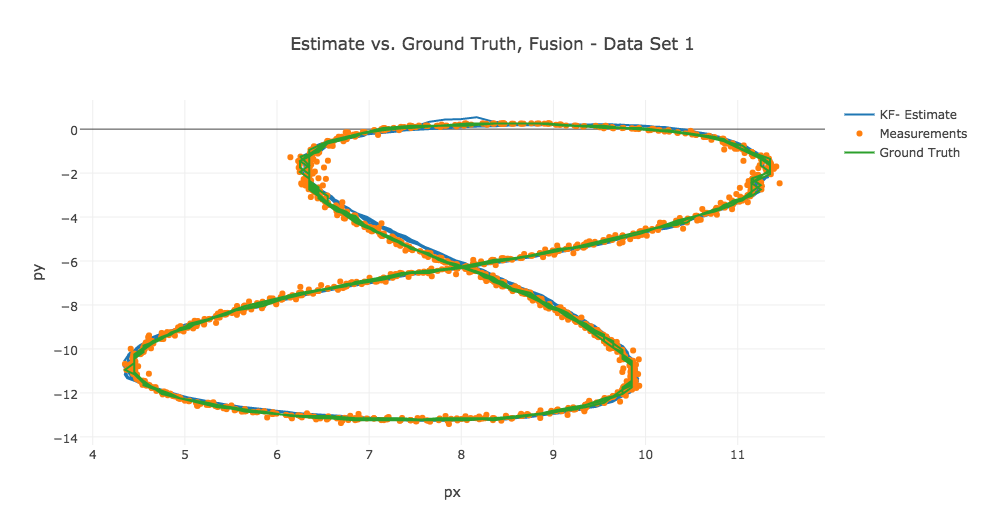
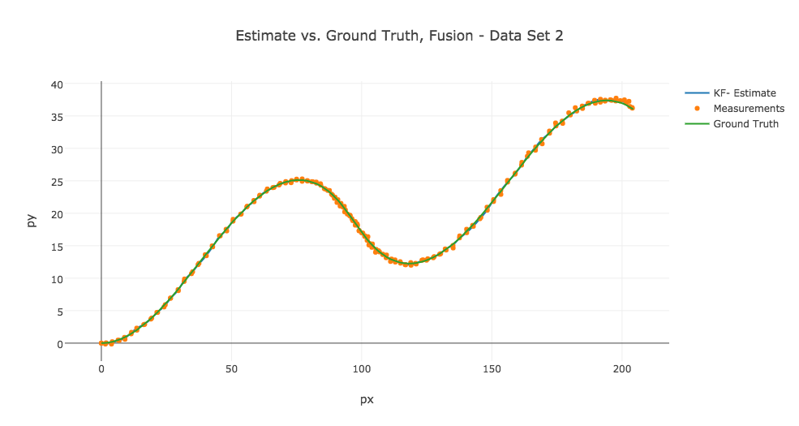
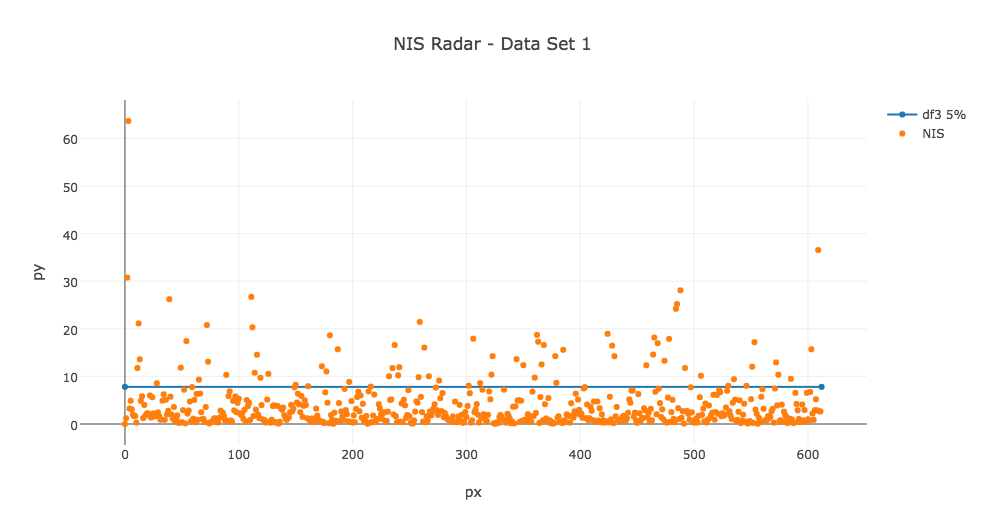
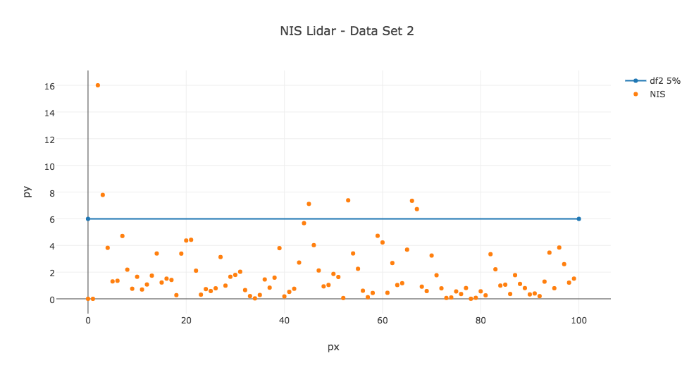

# Unscented Kalman Filter and Sensor Fusion Project
Self-Driving Car Engineer Nanodegree Program

---

## Dependencies

The project has been implemented and tested with OSX 10.11.4 and Ubuntu 14.04
using the following tools:

* cmake >= v3.2.2
* make >= v3.81
* gcc/g++ >= v4.2.1

## Basic Build Instructions

1. Clone this repo.
2. Make a build directory: `mkdir build && cd build`
3. Compile: `cmake .. && make`
4. Run it: `./UnscentedKF path/to/input.txt path/to/output.txt`. You can find
   some sample inputs in 'data/'.
    - eg. `./UnscentedKF ../data/sample-laser-radar-measurement-data-1.txt output.txt`

## Command line options and arguments

The following command line options are available:

```
UnscentedKF [-l|-r|-n <in>|-p <int>|-a <double>|-y <double>|-d|-D] inputfile outputfile
    -l - include lidar measurements from input file
    -r - include radar measurements from input file
    (omitting -l and -r includes all measurements)
    -p <int> - minimum rate (Hz) predictions are run
    -a <double> - stardard deviation of longitudial acceleration noise
    -y <double> - standard deviation of yaw acceleration noise
    -d - add some debugging output (add more d's to get more output)
    -n <int> - number of measurements, use only <int> first measurements of the data
    input - path to measurement input file
    output - path to prediction output file
```

Debug parameter can be `-d`, `-dd` or `-ddd` depending on the desired amount of 
debugging output. Highes level prints out all intermediate matrices.


## Default parameters

Parameters have following default value, which are used if the option is omitted
```
-l use lidar measurements if -r option is not set
-r use radar measurement if -l option is not se
-a 2.5
-y 0.8
-n -1 (use all measurements)
-p 20
```

By default, debugging is off. 

Process noise parameters (standard deviations `a` and `yawdd`) as selected by experiment to give for both data
set RMSE values that pass rubric requirements.

Other design parameters that have been selected are:

The initial covariance matrix P
```
0.1, 0,   0,   0,   0,
0,   0.1, 0,   0,   0,
0,   0,   0.1, 0,   0,
0,   0,   0,   0.1, 0,
0,   0,   0,   0,   0.1
```

Measurement noise matrix for lidar measurements (HW parameter):
```
0.0225, 0,
0,      0.0225
````

Measurement noise matrix for radar measurements (HW parameter):
```
0.9, 0,     0,
0,   0.009, 0,
0,   0,     0.9
```

Initial state vector for lidar measurements (initialized using the first measurement):
```
px, py, 0.1, 0.1, 0.1
```

Initial state vector for radar measurements:
```
rho * cos(phi), rho * sin(phi), 1.0, 1.0, 1.0
```

## Program output

After running the filter, program output basic statistics (used sensors, number of measurements, RMSE values for px, py, vx and vy, 
and consistency value for each sensor type (percentage of measurements above chi-squared 5% limit).

Example output: (see [sample outputs of a batch run](./output/results.txt)).
```
Sensors: Lidar Radar
Number of measurements: 1224
Accuracy - RMSE:
0.0635188
0.0727957
0.557945
0.564362
Consistency - percentage above Chi^2(0.050):
0.00163399
0.124183 
```

More detailed per measurement output is printed to output file. Output file format is described in [documentation](./Docs/Input_Output File Format.txt). 


## Batch run

To run filter for all data sets and sensor at one command use:

```./all.sh <options>```

Script runs the filter against both data sets, and get separate results for radar, lidar and sensor fusion. 
Resulting estimate files are stored in `output` directory. You can use all command line options, but 
sensor option `-l` and `-r` will change the output to unexpected - avoid those.

Accuracy - RMSE:
 45 0.176146 
 46 0.180731
 47 0.299565
 48 0.267969

## Results

RMSE values form data sets using default parameters:

| Parameter | Data Set 1 | Data Set 2 |
|:---------:|:----------:|:----------:|
| px        | 0.064      | 0.176      |
| py        | 0.073      | 0.181      |
| vx        | 0.558      | 0.300      |
| vy        | 0.564      | 0.268      |






Consistency values (measurements above Chi^2(0.050) limit):


| Sensor    | Data Set 1 | Data Set 2 |
|:---------:|:----------:|:----------:|
| Radar     | 0.124   | 0.01       |
| Lidar     | 0.005   | 0.06       |







## Code structure

* `main.cpp` : creates sensor container and measurement container (from input file), runs each measurement through filter and outputs results.
* `Sensor.h` and `Sensor.cpp` : Implement `Sensor`-classes. Each sensor has typical noise values. Sensor class also implements sensor type 
dependent part of UKF update phase `PredictMeasurement()-method`. `LidarSensor` and `RadarSensor` are concrete classes that inherit abstract `Sensor` class.
* `Measurement.h` and `Measurement.cpp` : Implement `Measurement`-classes. Measurement objects store the actual measurements values, the actual ground thruth at the measurement time (from input), calculated state estimate (UKF output) and calculated NIS value. `LidarMeasurement` and `RadarMeasurement` are concrete classes that inherit abstract `Measurement` class
* `MeasurementFactory.h` and `MeasurementFactory.cpp` : Implement factory pattern for measurement instantiation. Factory is a singleton.
* `UnscentedKalmanFilter.h` and `UnscentedKalmanFilter.cpp` : Implement UKF predict and update phases.
* `Tools.h` and `Tools.cpp` Helper routines for example consistency check and RMSE calculations.


## Notes about the implementation

Important part about the UKF algorithm is matrix square root of covariance matrices by Cholesky decompositon. Cholesky decomposition requires
by definition positive semi-definite matrix (eigenvalues of the matrix are >= 0). Numerical implementation of the algorithm seems to be very sensitive and, 
especially with untuned parameters, may produce non positive semi-definite matrices (negative eigen values). This in turn leads to fast growth of values (because 
coeffients were not square rooted) in covariance matrix, and ultimate total failure (NaN values).

In order to tackle this problem, several enhancements was made to the algoritm. 

* First detection of Cholesky decomposition failures:

```
    // Take matrix square root
    // 1. compute the Cholesky decomposition of P_aug
    Eigen::LLT<MatrixXd> lltOfPaug(P_aug);
    if (lltOfPaug.info() == Eigen::NumericalIssue) {
        // if decomposition fails, we have numerical issues
        if (debug_) {
            std::cout << "LLT failed!" << std::endl;
            Eigen::EigenSolver<MatrixXd> es(P_aug);
            cout << "P_aug:" << P_aug << endl;
            cout << "Eigenvalues of P_aug:" << endl << es.eigenvalues() << endl;
        }
        throw std::range_error("LLT failed");
    }
    // 2. get the lower triangle
    MatrixXd L = lltOfPaug.matrixL();

```

This is done during prediction phase when augmented sigma points are generated. Basically we just detect the failure and throw an exception. There is no point continuing
calculation after this failure

* Restarting the filter after the failure

In order not to fail totally, the filter is restarted using the previous measurement. This is done in `ProcessMeasurement()`  method:

```
    try {
        Prediction(dt);
    } catch (std::range_error e) {
        restart_ = true;
        // If convariance matrix is non positive definite (because of numerical instability?),
        // restart the filter using previous measurement as an initializer.
        InitializeMeasurement(previous_measurement_);
        // Redo prediction using the current measurement
        // We don't get exception this time, because intial P is positive definite.
        Prediction(dt);
    }
```

* Preventing failures by stepwise prediction

One second measurement delta seems to be one source of problems. Mitigation was to do prediction step-wise. Step length can be controlled by `-p` option.
Stepping is implemented in `ProcessMeasurement()` method.

```
    do {
        double t = (rdt > pred_int) ? pred_int : rdt;

        try {
            Prediction(dt);
        } catch ... {
            ....
        }

         rdt -= t;
 
     } while (rdt > 0.0);
```

* Angle normalization

When things start to go wrong, angle values grow rapidly, and normalization by addition/substraction loop seems very soon like infinite loop. 
This was mitigated by simple remainder calculation, but actually it turned out that the optimizations above made this useless. Angle values 
should never grow very much, and in normal case normalization requires only one addition/substraction operation.

```
const double Tools::PI2 = 2 * M_PI;
#define NORM_ANGLE_LOOP
//#define NORM_ANGLE_CEIL
        
double Tools::NormalizeAngle(double a) {
#if defined(NORM_ANGLE_LOOP)
    int n = 0;
    while (a > M_PI)  {a -= Tools::PI2; n++;}
    while (a < -M_PI) {a += Tools::PI2; n++;}
    //if (n>0)
    //    std::cout << "normalize operations: " << n  << std::endl; 
    return a;
#elif defined(NORM_ANGLE_CEIL)
    return a - ceil((a-M_PI)/(Tools::PI2))*Tools::PI2;
#else       
    return a;
#endif  
 }
```

## Algorithm modification

### Covariance matrix calculations

The enhancements described above were implemented in order to mitigate problems caused by non-positive semi-definite covariance matrices. However the 
reason why the algoritm produced these 'invalid' matrices remained unknown. 

In a paper **A New Method for the Nonlinear Transformation of Means and Covariances in Filters and Estimators**, *IEEE TRANSACTIONS ON AUTOMATIC CONTROL, VOL. 45, NO. 3, MARCH 2000* Julier et al. present a modification, which addresses the covariance matrix problem. The root cause to the problem is said to be  negative lambda term, that causes negativ esigma points weights. When lambda is negative, the state covariance matrix may not meet positive semi-definite requirement.  

A member variable `modified_` was added to `UnscentedKalmanFilter` class and the modification was implemented in the function `UnscentedKalmanFilter::PredictMeanAndCovariance()`: 

```
// predicted state covariance matrix
for (int i=(modified_)?1:0; i<n_sigma_; i++) {  // iterate over sigma points

  // state difference
  VectorXd x_diff;
  if (modified_)
      x_diff = Xsig_pred.col(i) - Xsig_pred.col(0);
  else
      x_diff = Xsig_pred.col(i) - x;
  NormalizeState(x_diff);

  P = P + weights_(i) * x_diff * x_diff.transpose();
}
```

The paper does not mention it, but the same modification was added to measurement covariance matrix calculation (`Sensor` -class). This was experimentally observed to
increase algorithm's robustness.

This feature is available with `-m` command line option. One `-m` adds the state covariance matrix modification and `-mm` adds  the modification to both state and measurement covariance matrix calculations.


Examples: 
The first run below runs into problems in Cholesky decomposition. Adding the modification, the algorithm passes without problems.

```
$ ./UnscentedKF -y 5 -a 100 -p 0 sample-laser-radar-measurement-data-2.txt out2.txt
Sensors: Lidar Radar
Number of measurements: 200
Filter restarted at measurement 11
Filter restarted at measurement 33
Filter restarted at measurement 89
Filter restarted at measurement 95
Filter restarted at measurement 113
Filter restarted at measurement 123
Filter restarted at measurement 147
Accuracy - RMSE:
  0.2955
0.289151
 17.8928
 13.4956
Consistency - percentage above Chi^2(0.050):
 0.2
0.09
Done!
$ ./UnscentedKF -mm -y 5 -a 100 -p 0 sample-laser-radar-measurement-data-2.txt out2.txt
Sensors: Lidar Radar
Number of measurements: 200
Accuracy - RMSE:
0.599426
0.717348
 10.7083
 11.2521
Consistency - percentage above Chi^2(0.050):
0.25
0.07
Done!
```

### Spreading factor

Spreading factor determines the lambda design parameter: `lambda = spreading factor + number of augmented sigma points`. Negative lambda is the source of invalid covariance matrices, so a possibility to adjust lambda using spreading factor was added. Spreading factor can be changed using command line option `-s`. However, it is a recommended design heuristic to have `lambda + number of augmented sigma points == 3`. So, 3 is the default value for the spreading factor.

Examples:
The first run below runs into problems in Cholesky decomposition. Changing spreading factor to 8, the algorithm passes without problems.

```
$ ./UnscentedKF -y 5 -a 100 -p 0 sample-laser-radar-measurement-data-2.txt out2.txt
Sensors: Lidar Radar
Number of measurements: 200
Filter restarted at measurement 11
Filter restarted at measurement 33
Filter restarted at measurement 89
Filter restarted at measurement 95
Filter restarted at measurement 113
Filter restarted at measurement 123
Filter restarted at measurement 147
Accuracy - RMSE:
  0.2955
0.289151
 17.8928
 13.4956
Consistency - percentage above Chi^2(0.050):
 0.2
0.09
Done!
$ ./UnscentedKF -s 8 -y 5 -a 100 -p 0 sample-laser-radar-measurement-data-2.txt out2.txt
Sensors: Lidar Radar
Number of measurements: 200
Accuracy - RMSE:
0.591052
 0.29661
 24.0051
 31.9052
Consistency - percentage above Chi^2(0.050):
0.67
0.22
Done!
```
